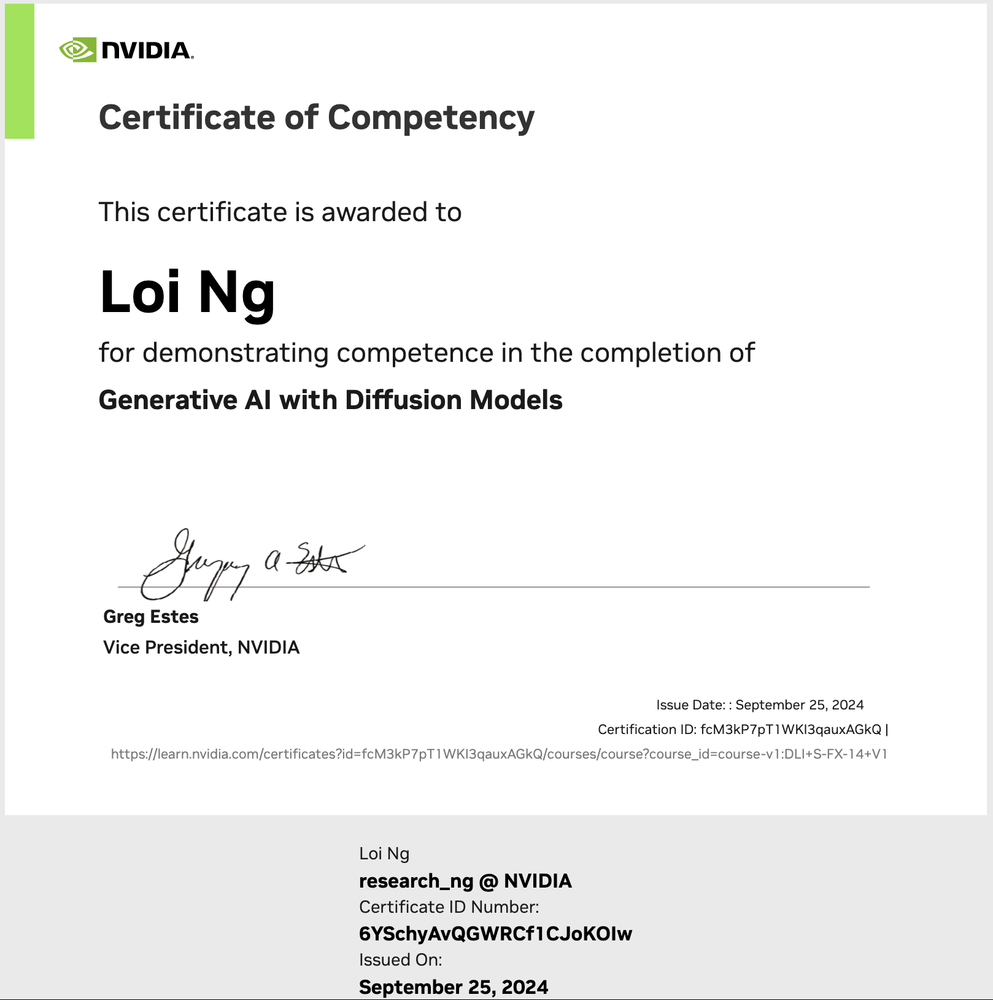

## 全面掌握「基于 Diffusion Model 的生成式人工智能」

### [AIPM 🌿 COMMUNITY 人工智能产品管理](https://roadmaps.feishu.cn/wiki/RykrwFxPiiU4T7kZ63bc7Lqdnch)

直接从下表运行笔记本：
| 主题 | Colab | Kaggle | PDF |
| :-------- | :-------- | :------- | :------- |
| | | | |
**1. 从 U-Net 到 Diffusion**
|<ul><li>From U-Net to Diffusion</li></ul>||| [PDF](Diffusion_Models/zh/Slides/Slides1-FromUNetsToDiffusion.pdf) |
**2. 去噪扩散概率模型**
|<ul><li>Diffusion Models</li></ul>||| [PDF](Diffusion_Models/zh/Slides/Slides2-DenoisingDiffusionProbabilisticModels.pdf) |
**3. 优化**
|<ul><li>Optimizations</li></ul>||| [PDF](Diffusion_Models/zh/Slides/Slides3-Optimizations.pdf) |
**4. 无分类器引导扩散**
|<ul><li>Classifier-Free Diffusion Guidance</li></ul>||| [PDF](Diffusion_Models/zh/Slides/Slides4-Classifier-FreeDiffusionGuidance.pdf) |
**5. 对比语言-图像预训练(CLIP)**
|<ul><li>Contrastive Language-Image Pre-Training</li></ul>||| [PDF](Diffusion_Models/zh/Slides/Slides5-CLIP.pdf) |
**6. 最先进的模型**
|<ul><li>Assessment</li></ul>||| [PDF](Diffusion_Models/zh/Slides/Slides6-StateOfTheArtModels.pdf) |

#### [加入社区 🌿 AIPM](https://www.theforage.cn/community)
#### [与我联系 🐬 5LOI](https://5loi.com/about_loi)

